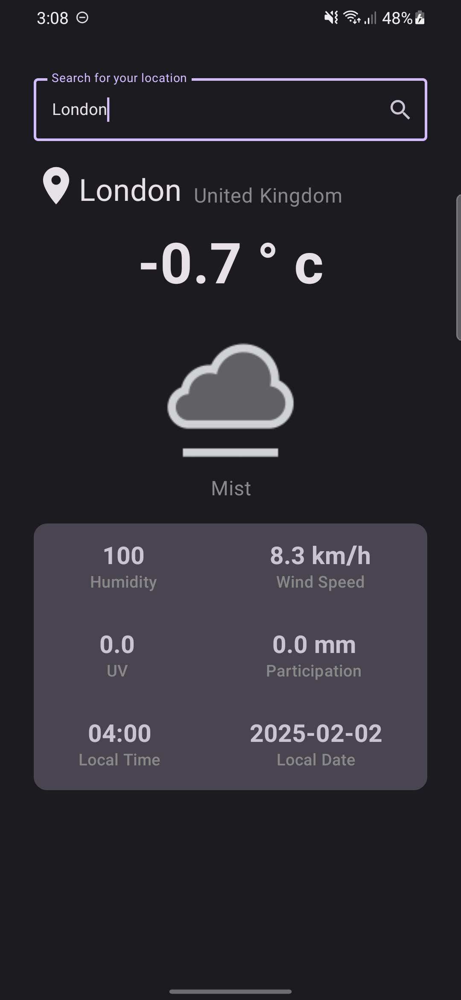

## ☂️ WeatherAppCompose
*A Jetpack Compose-based Weather App for Android*



### 📌 Overview
WeatherAppCompose is a simple yet functional weather application built using **Jetpack Compose**. It fetches real-time weather data based on user input and displays essential weather details such as temperature, humidity, wind speed, and more.

### 🛠 Tech Stack
- **Kotlin** 🟡
- **Jetpack Compose** 📱
- **Retrofit** 🌐 (for API calls)
- **Coroutines & Flow** 🛠 (for async operations)
- **MVVM Architecture** 🏠

### ✨ Features
- 🌍 **Search for any city worldwide**
- 🌡 **Displays current temperature**
- ☁ **Weather conditions with icons**
- 💧 **Humidity, wind speed, UV index, and precipitation details**
- ⏰ **Local time and date**
- 🔄 **Live weather updates from API**

### 📸 Screenshots


### 📦 Installation
1. **Clone the repository**:
   ```bash
   git clone https://github.com/iRahulGaur/WeatherAppCompose.git
   ```
2. **Open the project in Android Studio** (Latest stable version recommended)
3. **Get a free API key** from [WeatherAPI.com](https://www.weatherapi.com/) (or any weather API you're using)
4. **Add API Key** in `Constants.kt` or within the Retrofit client
5. **Run the app** on an emulator or a physical device

### 🏰 Architecture
The app follows **MVVM (Model-View-ViewModel)** architecture:
- **Model**: Handles API calls and data sources
- **ViewModel**: Manages UI-related data and logic
- **Compose UI**: Jetpack Compose-driven UI for smooth and declarative UI rendering

### 🔥 Future Improvements
- 🌎 Support for multiple languages
- 📊 Weather forecast for upcoming days
- 🌃 Dark mode theme
- 📍 Automatic location-based weather detection

### 🤝 Contributing
Contributions are welcome! Feel free to fork the repo, create a branch, and submit a pull request.

### 🐝 License
This project is **MIT Licensed**. Feel free to use and modify it as per your needs.

---

Enjoy coding! 🚀
